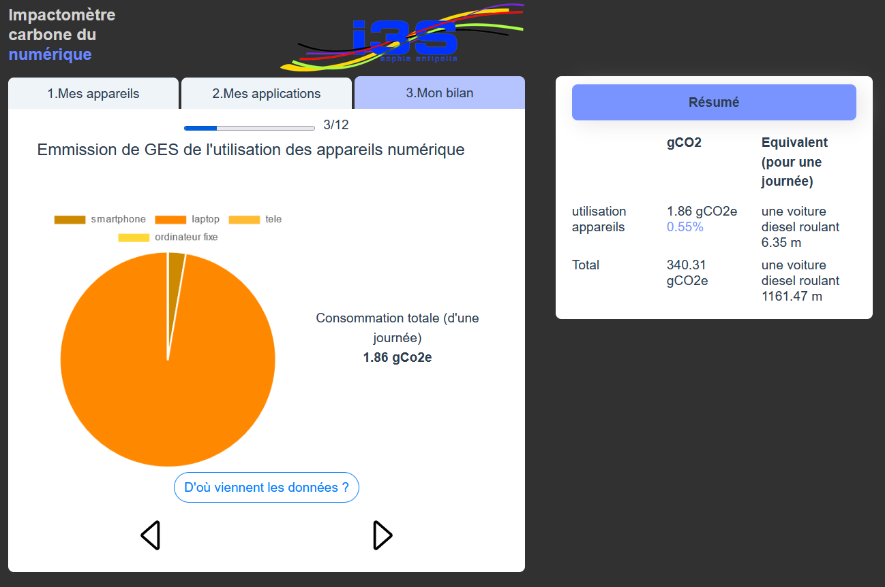

# calculateur-ges-num

### Présentation

Ce projet a pour vocation de développer un outil permettant de mesurer l'impact carbone de votre utilisation du numérique. Il se présente sous la forme d'une interface intuitive par laquelle on peut spécifier les appareils numériques que l'on utilise sur une journée ainsi que les services numériques que l'on effectue.

Vous pouvez trouver une version du site sur : https://mon-impact-numerique.web.app/


### Project setup

Ce projet est développé en Vue 2. Ce choix a été fait pour le caractère component-oriented du framework et pour sa capacité à monter rapidemment en fonctionnalités. 

Pour installer les dépendances : 
```
npm install
```

Pour lancer l'environnement de développement
```
npm run serve
```

Pour build le projet
```
npm run build
```

Cela génère le dossier */dist* qui contient une version du site prête à être déployée.  

### Documentation 

##### Plan
  
    1. Structures
    2. Calcule des GES


#### I. Structures


L'application est divisée en trois pages :

  - La saisie des appareils numériques

  
  
  
  - La saisie des services numériques


  - Le bilan de consommation




Les implémentations de ces trois pages se trouvent dans le dossier *views*. On navigue de l'une à l'autre grâce à la barre de navigation composée de trois onglets. Les implémentations des composants qui composent ces trois pages sont regroupées dans le dossier *misc*.
